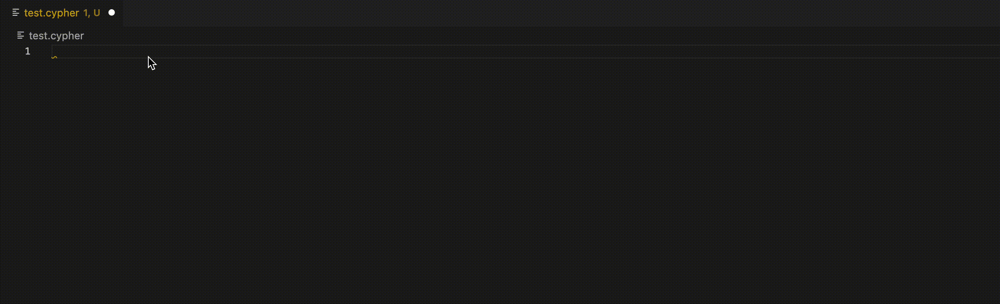

# cypher-lsp

The mono repo for Neo4j's Cypher Language support, it contains:

- LSP server.
- VSCode extension playground for testing.
- Web Editor (codemirror) playground

The Trello board for the project is [here](https://trello.com/b/0MAa3MMW/cypher-language-support).



## Features

- Syntax colouring.
- Auto completion.
- Errors highlighting.

## Getting started

Install [antlr4-tools](https://github.com/antlr/antlr4-tools). This will install the `antlr4` and auxiliary tools to work with the parser (like `antlr4-parse`).

Run `npm install` in the root folder. This installs all dependencies in each package and generates the parser in the server package. The next steps depend on which project you want to run.

After that, execute `npm run build`, which should compile the full project.

### Running the codemirror demo

Please refer to the [codemirror-playground/README.md](./packages/codemirror-playground/README.md) for a detailed explanation.

### Running the VScode playground

Please refer to the [vscode-playground/README.md](./packages/vscode-playground/README.md) for a detailed explanation.

### Running only the parser

The parser is generated on install, but if you change the .g4 grammar files you can re-generate it using the following command in the server package:

```
npm run gen-parser
```

Once antlr4-tools is installed, then you can run the parser in standalone mode with:

```
antlr4-parse server/src/antlr/Cypher.g4 oC_Cypher -gui
[Write query][Enter]
[Ctrl-D]
```
