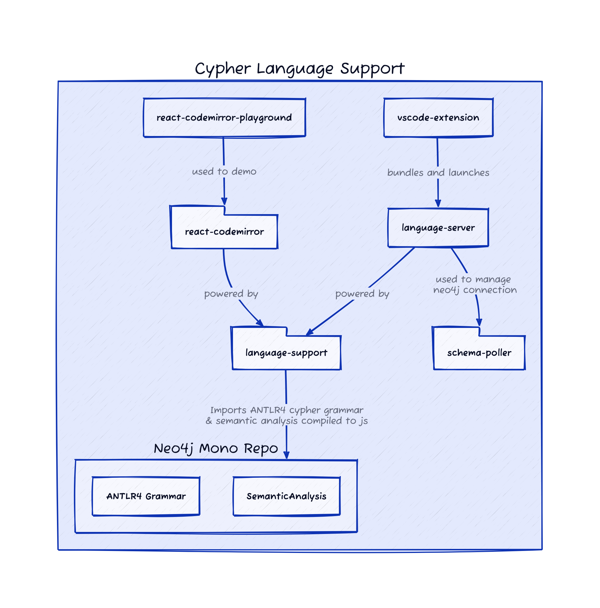

# Neo4j Cypher Language Support

This mono repo contains packages that together make up Neo4j's Cypher Language support.

## Project status

The project is in an early stage. We are still missing important features and the project is not yet stable. We welcome feedback and contributions!

Try it out in our [demo](https://neo4j.github.io/cypher-language-support/) or in our alpha releases in [Neo4j Workspace](https://workspace.neo4j.io) and soon also in our VS Code extension.

## Project Overview

The project comprises several packages:

- [language-support](./packages/language-support/README.md) - The core library implementing the language support features.
- [language-server](./packages/language-server/README.md) - The language server wrapper for the `language-support` package.
- [vscode-extension](./packages/vscode-extension/README.md) - The Neo4j VS Code extension which bundles the `language-server`
- [react-codemirror](./packages/react-codemirror/README.md) - A set of [codemirror6](https://codemirror.net/) cypher language support plugins and a react wrapper.
- [react-codemirror-playground](./packages/react-codemirror-playground/README.md) - A playground for the codemirror integration.
- [schema-poller](./packages/schema-poller/README.md) - An internal package we use to manage the Neo4j connection and keep the schema (procedure names, labels, database names, etc.) up to date in the language server.

## Capabilities

- Syntax highlighting
- Autocompletion
- Linting

## Building the project and contributing

See [CONTRIBUTING.md](./CONTRIBUTING.md).
