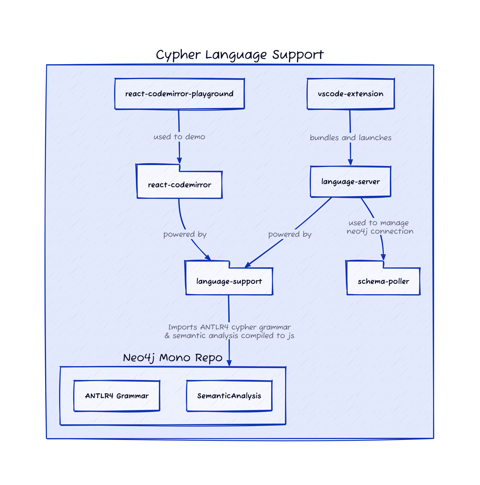

# Neo4j Cypher Language Support

This mono repo contains packages that together make up Neo4j's Cypher Language support.

## Project status

Try it out in our [demo](https://neo4j.github.io/cypher-language-support/), in [Neo4j Workspace](https://workspace.neo4j.io), or in our [VS Code extension](https://marketplace.visualstudio.com/items?itemName=neo4j.neo4j-for-vscode). We welcome feedback and contributions!

## Project Overview

The project comprises several packages:

- [language-support](./packages/language-support/README.md) - The core library implementing the language support features.
- [language-server](./packages/language-server/README.md) - The language server wrapper for the `language-support` package.
- [vscode-extension](./packages/vscode-extension/README.md) - The Neo4j VS Code extension which bundles the `language-server`.
- [react-codemirror](./packages/react-codemirror/README.md) - A set of [CodeMirror 6](https://codemirror.net/) Cypher language support plugins and a React wrapper.
- [react-codemirror-playground](./packages/react-codemirror-playground/README.md) - A playground for the CodeMirror integration.
- [lint-worker](./packages/lint-worker/README.md) - The Cypher lint worker used in both the language server and react-codemirror.
- [query-tools](./packages/query-tools/README.md) - An internal package for managing the Neo4j connection and keeping the schema (procedure names, labels, database names, etc.) up to date in the language server.
- [IntelliJ plugin](./editor-plugin/intellij) - An IntelliJ IDE plugin for Cypher language support.

## Capabilities

- Syntax highlighting (including embedded Cypher in Markdown, Java, Python, JavaScript/TypeScript, Go, C#, and F#)
- Autocompletion
- Signature help
- Linting
- Formatting

## Building the project and contributing

See [CONTRIBUTING.md](./CONTRIBUTING.md).
