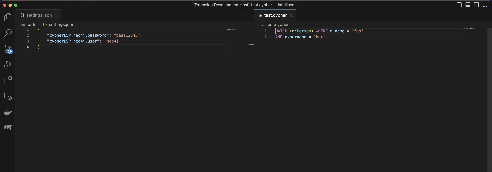

# vscode-playground

This is a VScode extension playground for testing the Cypher language server.

For running it, compile the code first:

```
npm install
npm run build
```

To launch a new VSCode window with the extension installed go to the `Run & Debug` tab (normally in the left pannel), select and run `VSCode Playground` clicking on the play ▷ button.

This will open a new window where we can open our folder of choice, create a file with `.cypher` extension and start typing cypher helped by the language support.

## running through the terminal. If you have

Note: VSCode must be installed and the `code` executabble must be in your path.

## Plugin settings

For database aware features (such as autocompleting labels, procedure names, etc), you can connect to a running database (Aura, neo4j docker, etc) by tweaking the playground settings, in the opened window.

The following settings are available in VSCode once the plugin is installed, which can be set either through the `Settings` menu on VSCode or by creating a `.vscode/settings.json` file in the window opened by the play button.

### Settings for database connection

The following settings refer to the database connection used for signature loading, this will allow for autocomplete on Labels and Types.

- `cypherLSP.neo4j.connect`: If true it will attempt to connect to a Neo4j database to retrieve signature information. Defaults to `true`.
- `cypherLSP.neo4j.user`: Defaults to `"neo4j"`
- `cypherLSP.neo4j.password`: Defaults to `"password"`
- `cypherLSP.neo4j.URL`: Defaults to `"bolt://localhost:7687"`



### Debug

- `cypherLSP.trace.server`: Traces the communication between VS Code and the language server for debugging purposes.
